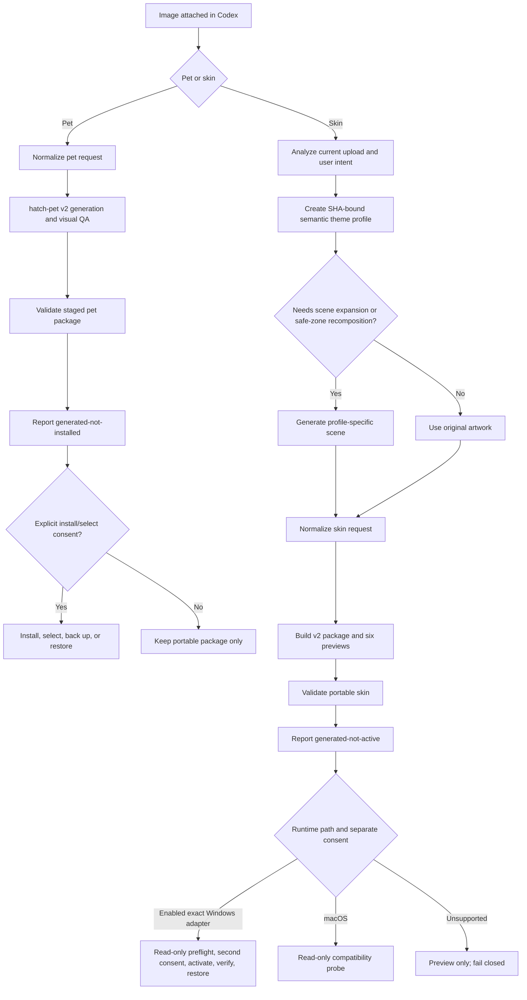

# Architecture

ChromaPaw separates image understanding, creative generation, deterministic packaging, validation, and live application integration. A runtime compatibility change should not invalidate portable artwork or a pet atlas.

## Plugin layer

The plugin manifest exposes pet creation, skin creation, and management skills. Plugins can package skills and supporting scripts. ChromaPaw keeps desktop skin activation experimental and separate from documented package generation.

## Pet pipeline

1. `prepare_pet_request.py` normalizes one reference image, identity, style, and state-action intent.
2. A compatible installed `hatch-pet` skill owns visual generation, all 11 animation rows, 16 look directions, deterministic assembly, and visual QA.
3. ChromaPaw stages `pet.json` with the final PNG/WebP atlas outside the live pets directory.
4. `validate_pet_package.py` enforces safe relative paths, `spriteVersionNumber: 2`, and exact 1536×2288 geometry.
5. `install_pet.py` installs a new id or, with explicit replacement, moves the previous package into `.chromapaw-backups`. With `--select`, `pet_selection.py` edits only the desktop pet key, backs up an existing config, and rejects ambiguous config state. `restore_pet.py` reverses the package operation through the same validation path.

## Skin Studio pipeline

1. The skin skill inspects only the current source and user request.
2. `prepare_theme_profile.py` records source kind, style, mood, identity cues, motifs, avoid-elements, four image-specific depth descriptions, safe-zone guidance, and the reference SHA-256.
3. If the source is not a complete environment, or if a salient face, character, logo, or hero object overlaps the reading/input safe zone, image generation expands or recomposes it using that profile. Safe complete environments can use the approved original directly. Examples never supply default content.
4. `prepare_skin_request.py` verifies the reference hash, embeds the semantic profile, separates original reference from approved artwork, and independently records subject placement, subject display priority, content-layout policy, mode, and attribution.
5. `build_skin_package.py` resolves normal width versus side reservation from that policy, converts artwork to a bounded PNG, extracts palettes, derives contrast-safe semantic UI roles, overrides Codex/VS Code color tokens, emits fixed/adaptive CSS, renders six previews, and preserves the semantic profile in the package. A side position alone never shrinks content; automatic reservation requires a side-staged showcase subject.
6. `validate_skin_package.py` accepts legacy v1 packages and strictly validates v2 paths, semantics, palettes, contrast, safe zones, depth layers, variant coverage, attribution, and passing QA.

The CSS contains an avatar-overlay guard because Codex may load the same stylesheet in a transparent pet window. The guard isolates the overlay frame and hit regions but deliberately does not reset `.codex-avatar-root`, which owns the pet spritesheet background. Stable `data-avatar-overlay-*` attributes scope a separate notification palette whose card, title, body, and controls each pass contrast against their actual surface. The stable `data-app-shell-focus-area="right-panel"` region receives its own surface, text, secondary-text, and section roles so a nested host-theme scope cannot separate the panel background from its foreground palette. The broader semantic token layer reconciles the skin's selected light/dark mode with Codex's host theme so menus, navigation, editors, inputs, and terminals do not retain an unreadable foreground palette.

## Runtime layers

### Windows Runtime Beta

`windows_runtime.py` owns an exact-version, fail-closed lifecycle and `cdp_client.py` provides a dependency-free loopback HTTP/WebSocket client. Preflight hashes the executable, adapter, package, and compiled CSS. Activation injects only into allowed `app://` targets, monitors delayed windows, and restores the runtime-owned process without changing application files. A successful activation stores a non-secret preferred-skin identity; installed shortcuts also pin that identity to the exact immutable hosted runtime generation that was reviewed. `resume` revalidates every identity after a normal exit without inheriting later plugin code. For a reviewed CSS-only repair, `refresh-active-css` updates an active session transactionally, while `refresh-preference` updates only an inactive saved preference; both recheck immutable package, executable, app, and adapter identity. `windows_skin_launcher.py` provides the quiet entry point and falls back only to the hash-verified ordinary Codex executable when skin recovery fails, while `windows_shortcut.py` adds and removes separate Desktop and Start Menu entries using semantic ownership hashes without modifying the application-managed shortcut.

See [WINDOWS_RUNTIME_BETA.md](WINDOWS_RUNTIME_BETA.md).

### macOS compatibility probe

`macos_compat.py` reads `Info.plist`, hashes the bundle's declared executable, records Electron packaging signals, and validates a selected skin package. Its registry is locked to `activationImplemented: false`, every adapter must have `activationEnabled: false`, and there is no activation command.

`macos_enhanced_test.py` adds a CI-only evidence layer on Apple Silicon and Intel GitHub-hosted macOS runners. It uses the production skin builder, validators, pet installer, backup/restore path, and compatibility probe. `macos_visual_smoke.mjs` loads the generated CSS into a Codex-shaped Chromium fixture whose stable attributes mirror the main right-panel and avatar-overlay contracts; it measures computed contrast, checks transparent overlay isolation, preserves `.codex-avatar-root`, and emits screenshots. The fixture is intentionally not coupled to a signed Codex bundle and cannot enable activation.

See [MACOS_COMPATIBILITY.md](MACOS_COMPATIBILITY.md).

## Compatibility strategy

Portable packages, semantic profiles, and runtime adapters have independent schemas. A Codex selector, launch model, operating-system policy, or version change disables live activation until an exact adapter passes real-device verification. Generation and preview remain available independently.

## Non-goals

- Patching signed Codex application files, `app.asar`, `WindowsApps`, or macOS app bundles.
- Weakening AppX, Gatekeeper, code-signing, or platform execution protections.
- Opening a fixed, externally reachable, or long-lived debugging port.
- Claiming compatibility with an unknown, discovery-only, or fixture-only version.
- Reusing beach or any other scene motif across unrelated uploads.
- Hosting or collecting user images.
