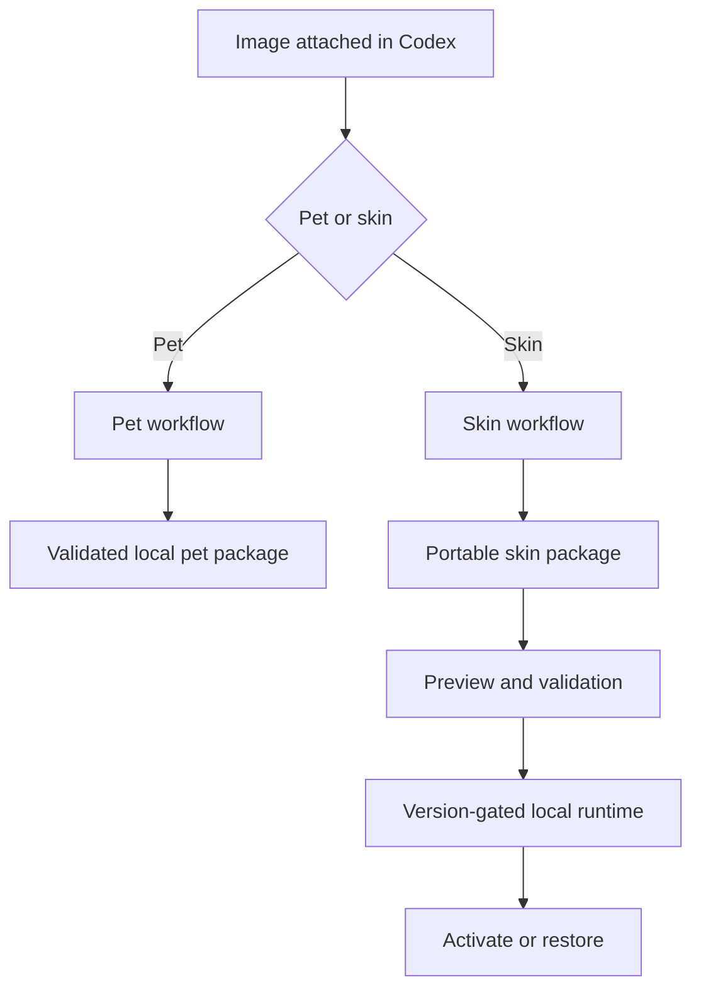

# Architecture

ChromaPaw separates creative generation from live application integration. This keeps the reusable image and package pipeline stable even when Codex UI internals change.

## Components

### Plugin layer

The plugin manifest exposes three skills. It does not claim an MCP server, app, hook, or runtime until the corresponding component exists.

### Pet pipeline

The pet workflow delegates visual generation and atlas QA to the supported Codex custom-pet workflow. ChromaPaw adds intent collection, naming, packaging choices, and a clear review gate.

### Skin package pipeline

The skin workflow produces a portable directory containing `skin.json`, visual assets, CSS, preview media, and attribution metadata. Package creation is useful without activating the skin.

### Runtime adapters

Live activation is isolated behind platform and Codex-version adapters. A future adapter must expose start, verify, stop, and restore operations and must fail closed on unknown versions.

## Non-goals for 0.1

- Patching signed Codex application files.
- Shipping a persistent background watcher.
- Opening a fixed unauthenticated debugging port.
- Claiming compatibility with untested Codex versions.
- Hosting or collecting user images.

## Compatibility strategy

Skin packages are versioned independently from runtime adapters. A package remains portable when a UI selector changes; only the relevant runtime adapter should require an update.
