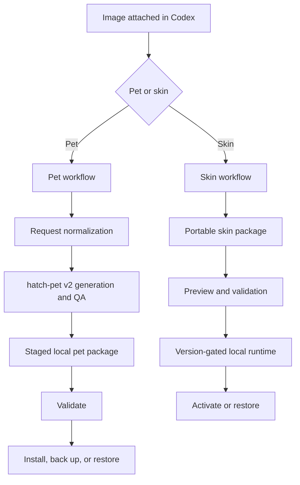

# Architecture

ChromaPaw separates creative generation from live application integration. This keeps the reusable image and package pipeline stable even when Codex UI internals change.

## Components

### Plugin layer

The plugin manifest exposes three skills. It does not claim an MCP server, app, hook, or runtime until the corresponding component exists.

### Pet pipeline

The pet workflow separates creative work from live installation:

1. `prepare_pet_request.py` normalizes one reference image, identity, style, and state-action intent.
2. The installed `hatch-pet` skill owns visual generation, all 11 animation rows, 16 look directions, deterministic assembly, and visual QA.
3. ChromaPaw stages `pet.json` with the final PNG/WebP atlas outside the live pets directory.
4. `validate_pet_package.py` enforces safe relative paths, `spriteVersionNumber: 2`, and exact `1536×2288` geometry.
5. `install_pet.py` installs a new id or, with explicit replacement, moves the previous package into `.chromapaw-backups` first. `restore_pet.py` reverses that operation through the same validation and staging path.

The structural ChromaPaw validator does not replace hatch-pet's alpha, animation, direction, continuity, or visual-identity gates.

### Skin package pipeline

The skin workflow produces a portable directory containing `skin.json`, visual assets, CSS, preview media, and attribution metadata. Package creation is useful without activating the skin.

### Runtime adapters

Live activation is isolated behind platform and Codex-version adapters. A future adapter must expose start, verify, stop, and restore operations and must fail closed on unknown versions.

## Non-goals for 0.2

- Patching signed Codex application files.
- Shipping a persistent background watcher.
- Opening a fixed unauthenticated debugging port.
- Claiming compatibility with untested Codex versions.
- Hosting or collecting user images.
- Claiming a web-upload export format without an official tested contract.

## Compatibility strategy

Skin packages are versioned independently from runtime adapters. A package remains portable when a UI selector changes; only the relevant runtime adapter should require an update.
