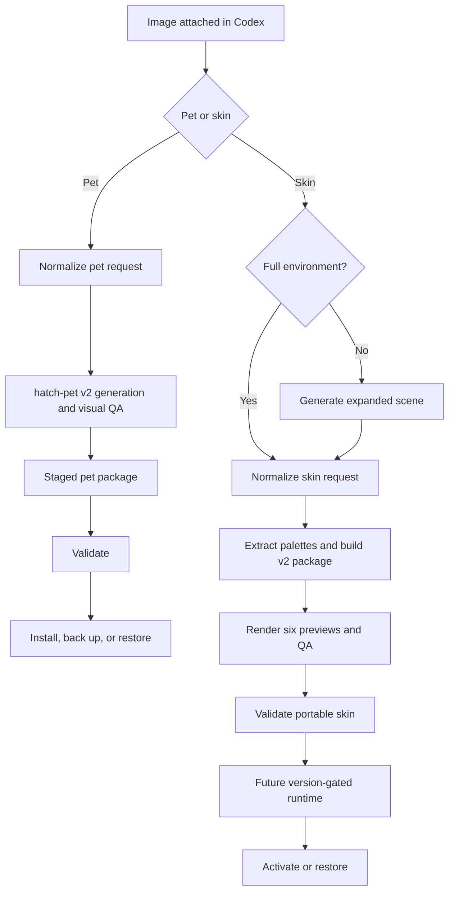

# Architecture

ChromaPaw separates creative generation, deterministic packaging, validation, and live application integration. Image and package workflows remain useful even when Codex UI internals change.

## Components

### Plugin layer

The plugin manifest exposes pet creation, skin creation, and package management skills. It does not claim an MCP server, app, hook, or live skin runtime until that component exists.

### Pet pipeline

1. `prepare_pet_request.py` normalizes one reference image, identity, style, and state-action intent.
2. A compatible installed `hatch-pet` skill owns visual generation, all 11 animation rows, 16 look directions, deterministic assembly, and visual QA.
3. ChromaPaw stages `pet.json` with the final PNG/WebP atlas outside the live pets directory.
4. `validate_pet_package.py` enforces safe relative paths, `spriteVersionNumber: 2`, and exact 1536×2288 geometry.
5. `install_pet.py` installs a new id or, with explicit replacement, moves the previous package into `.chromapaw-backups` first. `restore_pet.py` reverses the operation through the same validation path.

The structural ChromaPaw validator supplements rather than replaces hatch-pet's alpha, direction, continuity, animation, and identity gates.

### Skin Studio pipeline

1. The skin skill inspects the original image and uses image generation when a full environment is missing.
2. `prepare_skin_request.py` separates the original reference from approved scene artwork and normalizes identity, mode, scene guidance, and attribution.
3. `build_skin_package.py` converts artwork to a bounded PNG, extracts palettes, emits fixed and adaptive CSS, renders six previews, and records QA.
4. `validate_skin_package.py` accepts legacy v1 packages and strictly validates v2 paths, palettes, contrast, safe zones, depth layers, exact preview dimensions, variant coverage, attribution, and passing QA.

The generated CSS includes an avatar-overlay guard because Codex can load the main stylesheet in a separate transparent pet window. The guard prevents a skin surface from becoming a rectangle behind the pet.

### Runtime adapters

Live skin activation is isolated behind platform and Codex-version adapters. A future adapter must expose backup, start, verify, stop, and restore operations, and fail closed on unknown versions.

## Non-goals for 0.3

- Patching signed Codex application files.
- Modifying `WindowsApps`.
- Shipping a persistent background watcher.
- Opening a fixed unauthenticated debugging port.
- Claiming live skin compatibility with untested Codex versions.
- Hosting or collecting user images.

## Compatibility strategy

Skin packages are versioned independently from runtime adapters. SchemaVersion 2 adds palettes, variants, safe zones, depth layers, and QA while the validator remains compatible with schemaVersion 1. When a Codex selector changes, the runtime adapter should change; the portable artwork and metadata should not need to be regenerated.
