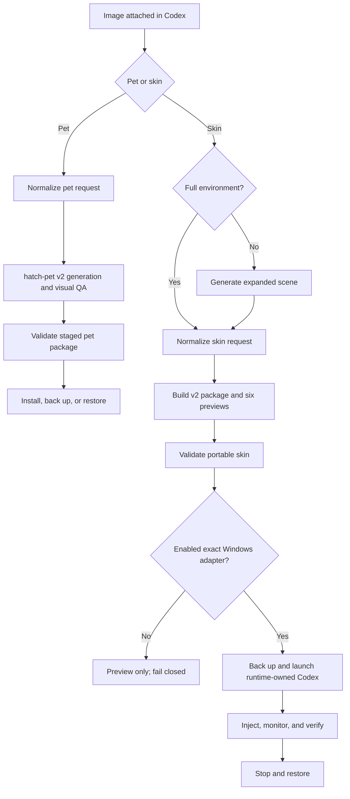

# Architecture

ChromaPaw separates creative generation, deterministic packaging, validation, and live application integration. A UI compatibility change should affect the runtime adapter, not the portable artwork or pet atlas.

## Plugin layer

The plugin manifest exposes pet creation, skin creation, and management skills. Codex plugins can package skills and supporting scripts, but ChromaPaw does not claim that the documented plugin surface includes a desktop skin API. The live Windows component is explicitly experimental.

## Pet pipeline

1. `prepare_pet_request.py` normalizes one reference image, identity, style, and state-action intent.
2. A compatible installed `hatch-pet` skill owns visual generation, all 11 animation rows, 16 look directions, deterministic assembly, and visual QA.
3. ChromaPaw stages `pet.json` with the final PNG/WebP atlas outside the live pets directory.
4. `validate_pet_package.py` enforces safe relative paths, `spriteVersionNumber: 2`, and exact 1536×2288 geometry.
5. `install_pet.py` installs a new id or, with explicit replacement, moves the previous package into `.chromapaw-backups`. `restore_pet.py` reverses the operation through the same validation path.

## Skin Studio pipeline

1. The skin skill inspects the source and uses image generation when a full environment is missing.
2. `prepare_skin_request.py` separates the original reference from approved scene artwork and normalizes identity, mode, guidance, and attribution.
3. `build_skin_package.py` converts artwork to a bounded PNG, extracts palettes, emits fixed/adaptive CSS, renders six previews, and records QA.
4. `validate_skin_package.py` accepts legacy v1 packages and strictly validates v2 paths, palettes, contrast, safe zones, depth layers, variant coverage, attribution, and passing QA.

The CSS contains an avatar-overlay guard because Codex may load the same stylesheet in a transparent pet window.

## Windows runtime

`windows_runtime.py` owns the lifecycle and `cdp_client.py` provides a dependency-free loopback HTTP/WebSocket client.

- The adapter registry is schemaVersion 1, exact-version, and fail-closed.
- Preflight hashes the executable, adapter file, skin manifest, and compiled CSS.
- Activation embeds the package background as a data URI and injects CSS only into adapter-allowed `app://` targets.
- A disclosed monitor handles delayed windows without modifying application files.
- Verification checks process identities, registry continuity, endpoint/browser identity, CSS hash, and session ownership.
- Restore stops the monitor, removes owned CSS, terminates the runtime-owned process tree, closes CDP, and safely reconciles a known volatile config key.

See [WINDOWS_RUNTIME_BETA.md](WINDOWS_RUNTIME_BETA.md) for the operational contract.

## Compatibility strategy

Skin packages and runtime adapters have independent schemas. A Codex selector, launch model, or version change disables activation until a new exact adapter passes isolated live verification. The portable package remains valid for preview and future adapters.

## Non-goals

- Patching signed Codex application files, `app.asar`, or `WindowsApps`.
- Weakening AppX execution protections.
- Opening a fixed, externally reachable, or long-lived debugging port.
- Claiming compatibility with an unknown or discovery-only version.
- Hosting or collecting user images.
- Providing a macOS runtime in 0.4.
