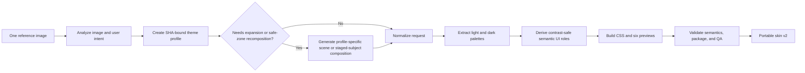

# Skin Studio MVP

ChromaPaw turns one reference image into a complete, portable skin bundle. Skin Studio owns image-specific semantic analysis, optional scene expansion, deterministic package construction, and visual review. Activation remains a separate, explicitly authorized runtime operation.

## What one-image generation means

The upload and current request are the only creative brief. ChromaPaw first creates a source-bound semantic profile. When the upload is already a full environment, Skin Studio builds from it directly. When it is a character, object, texture, abstract cue, or logo, the skin skill expands it into approved environmental artwork using only the profile and reference image.

## Semantic isolation

`theme-profile.json` records:

- reference image SHA-256;
- source kind, theme name, visual style, and mood;
- recognizable identity cues;
- supported motifs and explicit forbidden elements;
- atmosphere, distant, midground, and foreground descriptions;
- central reading and bottom input safe-zone guidance.

The four layers describe spatial depth, not fixed scenery. A motif cannot also be forbidden. Request preparation rejects a profile created from a different image. Non-beach regression fixtures cover blue-sky and comic themes to prevent example leakage.

A full environment can still be unsuitable for an interface when its face, character, logo, or hero object sits under the reading/input safe zone. In that case Skin Studio preserves identity and style while recomposing the artwork into a desktop-width scene with the subject staged left or right and calm negative space on the opposite side. It must not manufacture readability by fading, blurring, or globally fogging the source.

## Outputs

- a normalized PNG background capped at 2400×2400;
- automatic light and dark palettes with at least 4.5:1 surface-to-ink contrast;
- contrast-safe primary, secondary, muted, accent, on-accent, elevated-surface, and input-surface roles for each mode;
- Codex and VS Code semantic token overrides for menus, title bars, navigation, editors, inputs, lists, toolbars, and terminals;
- light, dark, and adaptive stylesheets;
- six UI previews covering light/dark and 16:10, 16:9, and 4:3 windows;
- source-bound semantic profile, safe-content-zone, and four-layer depth metadata;
- subject-placement, recomposition-state, local-surface protection, and scene-fidelity metadata;
- source attribution that does not publish local image paths;
- structured QA with contrast, ratio coverage, semantic-profile, and pet-overlay-isolation checks.

The generated CSS contains an explicit guard for Codex's transparent avatar overlay. This prevents the skin background from being painted into the pet window as a rectangular block while leaving `.codex-avatar-root` free to render Codex's pet spritesheet. The background remains sharp with a small saturation/contrast lift; an 8% edge treatment and directional local reading veil replace the previous full-window wash. The notification tray receives its own image-derived surface, title, body, control surface, and control text roles because Codex's host material mode can differ from the active skin mode. The right-side task/settings panel likewise receives a paired image-derived surface, primary text, secondary text, and section palette through its stable app-shell focus marker. Semantic text roles are tested independently against their actual surfaces so a dark upload cannot inherit dark host-theme text, and a light upload cannot inherit low-contrast light text.

## Build dependency

Theme-profile preparation, request preparation, compatibility probes, and validation use the Python standard library. Building and preview rendering use Pillow. Inside Codex, use the bundled workspace Python runtime returned by the workspace dependency loader.

## Activation boundary

Skin Studio v2 packages are ready for preview, review, storage, and a separately supported runtime. Package validity does not imply runtime compatibility or activation consent.

After generation, ChromaPaw emits a non-mutating handoff. A skin is reported as `generated-not-active`; a pet is `generated-not-installed`. On Windows, `应用这个皮肤` is offered only when discovery finds an enabled exact-version adapter; it starts read-only runtime preflight and does not itself activate anything. Activation still requires the later experimental-runtime confirmation. Pet installation and selection likewise wait for `安装这个宠物`, or an id-specific replacement confirmation when a destination already exists. An already-open Codex may need to be closed and reopened before the selected pet appears.

- Windows activation is experimental and requires an exact enabled adapter after separate preflight and acknowledgment.
- macOS has a read-only compatibility probe but no activation implementation.
- Unsupported versions remain preview-only.

See [WINDOWS_RUNTIME_BETA.md](WINDOWS_RUNTIME_BETA.md) and [MACOS_COMPATIBILITY.md](MACOS_COMPATIBILITY.md).
