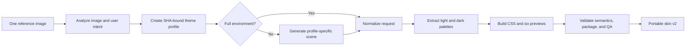

# Skin Studio MVP

ChromaPaw turns one reference image into a complete, portable skin bundle. Skin Studio owns image-specific semantic analysis, optional scene expansion, deterministic package construction, and visual review. Activation remains a separate, explicitly authorized runtime operation.

## What one-image generation means

The upload and current request are the only creative brief. ChromaPaw first creates a source-bound semantic profile. When the upload is already a full environment, Skin Studio builds from it directly. When it is a character, object, texture, abstract cue, or logo, the skin skill expands it into approved environmental artwork using only the profile and reference image.

## Semantic isolation

`theme-profile.json` records:

- reference image SHA-256;
- source kind, theme name, visual style, and mood;
- recognizable identity cues;
- supported motifs and explicit forbidden elements;
- atmosphere, distant, midground, and foreground descriptions;
- central reading and bottom input safe-zone guidance.

The four layers describe spatial depth, not fixed scenery. A motif cannot also be forbidden. Request preparation rejects a profile created from a different image. Non-beach regression fixtures cover blue-sky and comic themes to prevent example leakage.

## Outputs

- a normalized PNG background capped at 2400×2400;
- automatic light and dark palettes with at least 4.5:1 surface-to-ink contrast;
- light, dark, and adaptive stylesheets;
- six UI previews covering light/dark and 16:10, 16:9, and 4:3 windows;
- source-bound semantic profile, safe-content-zone, and four-layer depth metadata;
- source attribution that does not publish local image paths;
- structured QA with contrast, ratio coverage, semantic-profile, and pet-overlay-isolation checks.

The generated CSS contains an explicit guard for Codex's transparent avatar overlay. This prevents the skin background from being painted into the pet window as a rectangular block.

## Build dependency

Theme-profile preparation, request preparation, compatibility probes, and validation use the Python standard library. Building and preview rendering use Pillow. Inside Codex, use the bundled workspace Python runtime returned by the workspace dependency loader.

## Activation boundary

Skin Studio v2 packages are ready for preview, review, storage, and a separately supported runtime. Package validity does not imply runtime compatibility or activation consent.

- Windows activation is experimental and requires an exact enabled adapter after separate preflight and acknowledgment.
- macOS has a read-only compatibility probe but no activation implementation.
- Unsupported versions remain preview-only.

See [WINDOWS_RUNTIME_BETA.md](WINDOWS_RUNTIME_BETA.md) and [MACOS_COMPATIBILITY.md](MACOS_COMPATIBILITY.md).
