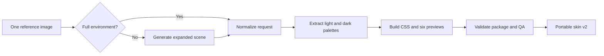

# Skin Studio MVP

ChromaPaw turns one reference image into a complete, portable skin bundle. Skin Studio owns deterministic package construction and visual review; activation remains a separate, explicitly authorized runtime operation.

## What one-image generation means

The original upload is the visual brief. When it is already a full environment, Skin Studio can build directly from it. When it is only a character, object, or palette cue, the skin skill first expands it into approved environmental artwork with the image-generation workflow, then passes that artwork to the deterministic builder.

## Outputs

- a normalized PNG background capped at 2400×2400
- automatic light and dark palettes with at least 4.5:1 surface-to-ink contrast
- light, dark, and adaptive stylesheets
- six UI previews covering light/dark and 16:10, 16:9, and 4:3 windows
- safe-content-zone and four-layer depth metadata
- source attribution that does not publish local image paths
- structured QA with contrast, ratio coverage, and pet-overlay isolation checks

The generated CSS contains an explicit guard for Codex's transparent avatar overlay. This prevents the skin background from being painted into the pet window as a rectangular block.

## Build dependency

Request preparation and validation use the Python standard library. Building and preview rendering use Pillow. Inside Codex, use the bundled workspace Python runtime returned by the workspace dependency loader.

## Activation boundary

Skin Studio v2 packages are ready for preview, review, storage, and the experimental Windows Runtime Beta. Package validity does not imply runtime compatibility or activation consent. ChromaPaw 0.4 activates only an exact enabled Windows adapter after a separate preflight and acknowledgment; unsupported versions remain preview-only. See [WINDOWS_RUNTIME_BETA.md](WINDOWS_RUNTIME_BETA.md).
